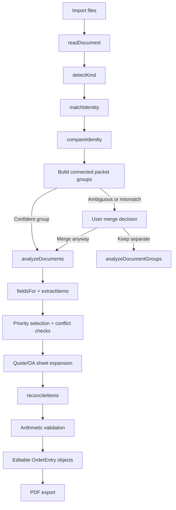

# Tulip Extraction Engineering Spec (v5)

**Purpose:** Condensed, code-oriented reference for how Tulip parses documents, groups packets, extracts fields, reconciles conflicts, builds order entries, and validates results.

**Primary implementation:** `tulip-order-entry/app/parser.ts`  
**UI mapping:** `tulip-order-entry/app/page.tsx`  
**PDF mapping:** `tulip-order-entry/app/pdf-export.ts`  
**Regression suite:** `tulip-order-entry/tests/rendered-html.test.mjs`

## 1. Pipeline



## 2. Core types

```ts
type DocumentKind =
  | "quotation"
  | "purchase order"
  | "order acknowledgement"
  | "other";

type ImportedDocument = {
  id: string;
  name: string;
  size: number;
  kind: DocumentKind;
  text: string;
  error?: string;
};

type OrderItem = {
  catalogNumber: string;
  description: string;
  price: string;
  poQty: string;
  extTotal: string;
};

type OrderEntry = {
  quoteNo: string;
  fields: Record<string, string>;
  sources: Record<string, string>;
  items: OrderItem[];
  itemSources: Record<string, string>;
};

type Analysis = {
  fields: Record<string, string>;
  sources: Record<string, string>;
  entries: OrderEntry[];
  items: OrderItem[];
  itemSources: Record<string, string>;
  checks: Array<{
    label: string;
    status: "ok" | "review";
    detail: string;
  }>;
};
```

## 3. Document ingestion

### PDF

`readDocument()` reads every page with PDF.js.

```text
PDF text items
  -> capture string + x/y coordinates
  -> sort by descending y, then ascending x
  -> group items whose y positions are within 2 points
  -> rebuild each line using estimated x spacing
  -> join all pages into one text buffer
```

This preserves enough column structure for Bill To/Ship To tables and item rows. Image-only PDFs are not OCRed.

### DOCX and text

- DOCX: Mammoth raw-text extraction.
- Other readable files: `file.text()`.

## 4. Classification

```ts
detectKind(text, filename): DocumentKind
```

Evaluation order:

1. Acknowledgment filename/text signatures.
2. Strong purchase-order filename/text signatures.
3. Quotation filename/text signatures.
4. Otherwise `other`.

Key safeguard: a PO containing copied quotation text remains a PO because classification occurs before field extraction.

## 5. Normalizers

| Function/concept | Output contract |
|---|---|
| `clean()` | Collapse whitespace and trim |
| `first()` | First regex capture from an ordered pattern list |
| `firstDate()` | Normalize supported dates to `M/D/YY` |
| `customerNo()` | Preserve IDs; zero-pad short numeric values to five digits |
| `poNo()` | Remove spacing around dashes and preserve identifier characters |
| `money()` | Canonical numeric string with two decimals |
| `quantity()` | Canonical numeric quantity without meaningless decimals |
| `incoterm()` | Short uppercase Incoterm code |
| `payment()` | Short operational payment phrase |
| `contactRows()` | Separate `Name`, `Email`, and `Mobile` lines |
| `companyKey()` | Normalized company identity for comparison |
| `catalogKey()` | Uppercase catalog identity without decorative `*` |

Normalization is applied before comparison and again before final validation.

## 6. Extraction architecture

```ts
fieldsFor(text, kind, filename)
extractItems(text, kind)
```

Each document is parsed independently into:

```ts
type ParsedDocument = {
  doc: ImportedDocument;
  fields: Record<string, string>;
  items: OrderItem[];
};
```

No field is copied between documents during this stage.

### Document-specific parsers

```text
quotation
  -> quoteHeader
  -> quoteProject
  -> quoteCustomer / quoteBillTo
  -> quoteItems

order acknowledgement
  -> ackBlocks
  -> ackProject
  -> ackQuoteSections
  -> ackItems

purchase order
  -> extractPoNumber / extractPoDate
  -> poAddresses / poCustomer
  -> poItems
```

## 7. Field mapping

### Core identifiers

| Target field | Main patterns |
|---|---|
| `projectName` | `PROJECT`, `PROJECT:`, `Project Name` |
| `customerNo` | `Cust#`, `Customer #`, `Customer No.` |
| `poNo` | `PO #`, `PO No.`, `PO NUMBER`, `Purchase Order Number`, title-adjacent ID |
| `orderNo` | OA `Order#`, quotation number, PO `Supplier Quotation #` |
| `poDate` | `PO Date`, `Date Ordered`, `Created on`, `Date Issued`, date/PO columns |
| `orderDate` | OA order date or PO `Supplier Quotation Date` |
| `poRevNo` | Explicit PO revision label only |
| `poRevDate` | Explicit PO revision-date label only |

### Standalone PO-number state machine

```ts
if (line matches /^PO NUMBER$/i) {
  const candidate = nextNonEmptyLine();
  accept(candidate) only if:
    - it is identifier-shaped;
    - it contains at least one digit;
    - it is not another heading;
}
```

This prevents the literal word `NUMBER` from being returned as the PO number.

### PO supplier-reference mapping

```text
Supplier Quotation #    -> orderNo
Supplier Quotation Date -> orderDate
Supplier Contact        -> donganContact
```

These fields do not populate PO Date or customer contact.

### Customer fallback

```ts
customerName =
  explicitCustomerName
  || firstPlausibleCompany(firstLine(billTo), firstLine(shipTo));
```

`plausibleCompany()` rejects headings, numeric/address-only values, and Dongan-as-vendor.

## 8. Address parsing

Supported strategies:

1. Explicit multiline labeled block.
2. Value on the same line as the label.
3. Standalone label followed by up to several address lines.
4. Two-column positional parsing.
5. Known legacy layout fallback.

Block termination tokens include:

```text
BILL TO
SHIP TO
PO NUMBER / PO NO.
PURCHASE ORDER
SUPPLIER QUOTATION
SUPPLIER CONTACT
LINE / ITEM TABLE
PAYMENT TERMS
TOTAL
```

The parser slices left/right columns before cleaning so flattened PDF text does not merge Bill To with Ship To.

## 9. Item extraction

### Generic output

Every supported row becomes:

```ts
{
  catalogNumber,
  description,
  price: money(unitPrice),
  poQty: quantity(orderedQty),
  extTotal: money(rowTotal)
}
```

### Supplier PO page-two row

Supported row shape:

```text
<line> <description> <need-by date> <qty> <Each|EA> <price> <total>
```

Example:

```text
00010 TRANSFORMER 1000KW, 10KVA T3 02/13/25 2 Each 3,780.00 7,560.00
```

Mapping:

```text
00010                         -> ignored line number
TRANSFORMER 1000KW, 10KVA T3 -> description
02/13/25                     -> estimatedShipDate
2                            -> poQty
Each                         -> ignored unit code
3,780.00                     -> price
7,560.00                     -> extTotal
```

The parser scans the following detail lines for:

```regex
/DONGAN\s+ELECTRIC\s+MFG\s+CO\s*:\s*([A-Z0-9-]{6,})/i
```

The first valid match becomes the catalog candidate. Long unlabeled material IDs are ignored.

## 10. Financial mapping

```text
Tax Value / Total Tax to Pay
  -> tax

Total Line Cost Purchase Order Value
  -> total

Total Net Purchase Order Value
  -> grandTotal
```

All values pass through `money()`.

Other supported financial patterns include merchandise total, subtotal, PO total, total amount, explicit shipping/freight charge, handling, surcharge, setup, and expedite fee.

## 11. Source-priority function

Conceptually:

```ts
function priority(field, kind): number {
  if (field in ["total", "orderNo", "orderDate"])
    return ack: 40, quote: 30, po: 20;

  if (field === "donganContact")
    return quote: 30, po: 20;

  return quote: 30, ack: 20, po: 20;
}
```

Only nonempty, field-compatible candidates with `score > 0` participate.

```ts
candidates
  .filter(hasValueAndValidScore)
  .sort(descendingPriority);

chosen = candidates[0];
sources[field] = chosen.document.name;
```

If another relevant candidate is not equivalent, Tulip adds a `review` check with all filenames and values.

## 12. Packet-matching graph

### Identity structure

```ts
type MatchIdentity = {
  doc: ImportedDocument;
  refs: string[];
  customer: string;
  po: string;
  project: string;
  catalogs: string[];
};
```

### Pairwise comparison

Four Boolean anchors are computed:

```ts
refMatch
customerMatch
poMatch
productMatch // catalog match, otherwise project match
```

Current confidence rule:

```ts
confident = refMatch || poMatch || matchingAnchorCount >= 3;
```

Hard-conflict combinations include:

```text
different customer + different Dongan references
different true PO + different customer
different references + different catalog/project identity
```

### Connected components

Pairwise confident matches are unioned with a disjoint-set/union-find structure.

```text
node = document
edge = confident pairwise relationship
connected component = packet group
```

One component runs automatically. Multiple components require a user decision.

## 13. Multi-quotation sheet expansion

```ts
ackQuoteSections(text)
```

The function scans the entire acknowledgment for unique `RE. QUOTE #` values.

```text
N unique quote references -> N OrderEntry objects
```

Shared fields are cloned to every entry. These remain entry-specific:

```text
quoteNo
projectName
items
item prices and quantities
quote total
```

If a referenced quotation file is missing, the sheet is still created from the acknowledgment section and receives a review check.

Multiple catalog rows do not create multiple sheets unless separate quotation references require the split.

## 14. Item reconciliation

```ts
reconcileItems(parsedDocs, checks, allowedCatalogs?)
```

Algorithm:

```text
normalize each item
  -> find matching allowed catalog
  -> otherwise find equivalent existing catalog group
  -> group candidates by canonical catalog
  -> select each item field by source priority
  -> record field source
  -> flag conflicting price/qty/extension/description
  -> flag catalog representation differences
  -> validate line arithmetic
```

Catalog equivalence currently allows:

- Exact normalized equality.
- Limited suffix equivalence when lengths differ by no more than five characters.

When a quote/OA supplies an allowed catalog list, unrelated PO item rows are filtered out of that Order Entry.

## 15. Validation invariants

### Line arithmetic

```ts
abs(price * poQty - extTotal) <= 0.011
```

### Order arithmetic

```ts
abs(sum(item.extTotal) - total) <= 0.011
```

### Grand total

```ts
grandTotal = total + tax + shipping + other
```

The grand-total equation is used only when every applicable component is known or explicitly zero.

### Semantic invariants

```text
quote date       != PO date
need-by date     != PO date
Incoterm         != shipping mode
freight terms    != shipping amount
Dongan contact   != receiving contact
material number  != catalog number without proof
```

## 16. Result construction

```ts
analyzeDocuments(documents): Analysis
```

High-level pseudocode:

```ts
parsed = documents.map(parseIndependently);
fields = chooseFieldsByPriority(parsed);
ackSections = collectAcknowledgmentQuoteSections(parsed);
seeds = buildEntrySeeds(ackSections, quotationDocs);

entries = seeds.map(seed => {
  entryFields = clone(sharedFields);
  applyQuoteSpecificProjectAndTotals(entryFields, seed);
  items = reconcileItems(parsed, seed.allowedCatalogs);
  fillMissingTotalFromItemExtensions(entryFields, items);
  return OrderEntry;
});

runCrossFieldChecks(entries);
return Analysis;
```

`analyzeDocumentGroups()` concatenates independently analyzed groups without copying customer, address, commercial, or item data across them.

## 17. UI and PDF contracts

### Editable UI

- Every extracted value is user-editable.
- Missing fields remain highlighted.
- Sources remain attached to fields/items.
- Item columns are ordered:

```text
Catalog Number | Description | Price | PO Qty | Ext. Total | Remove
```

- Remove control is red and visually strong.

### PDF

- Uses blue labels/shading and clear cell borders.
- Wraps long text instead of overflowing.
- Keeps major table blocks together where page space allows.
- Repeats one complete Order Entry per quotation reference.
- Uses the same Price → PO Qty → Ext. Total order.
- CSV export is disabled.

## 18. Review-check taxonomy

Common generated labels:

```text
Customer identity
Customer number
Purchase order
Order total
Field conflict - <field>
Pricing - <catalog>
Item - <catalog>
Catalog identity - <catalog>
Line arithmetic - <catalog>
Order arithmetic
PO date from filename
Quote <number> missing
<N> order groups kept separate
```

Review checks do not block editing/export; they identify values requiring human verification.

## 19. Regression coverage

Current suite: **19 passing tests**.

Coverage includes:

- Document classification across supplied sales packets.
- Known PO layouts and date/number variants.
- PO-only extraction.
- Multi-quotation acknowledgment expansion.
- Packet match versus unrelated quotations.
- Isolation of separate packet groups.
- Catalog, price, quantity, total, and discrepancy detection.
- Filename-date review fallback.
- Standalone `PO NUMBER` next-line value.
- Supplier quotation metadata/contact mapping.
- Bill To/Ship To customer fallback.
- Page-two supplier item/tax/total parsing.
- PDF structure and removed CSV feature.

## 20. Known technical limits

- No OCR for image-only PDFs.
- PDF row reconstruction is heuristic and can be affected by unusual coordinates.
- Regex/layout parsers require new regression fixtures as new customer formats appear.
- The first valid Dongan manufacturer number is currently selected in the newest PO block; multiple plausible values require review.
- Explicit reference or PO matches are intentionally strong and may require user confirmation when source documents contain incorrect references.
- Session edits are not stored in a durable database.

## 21. Safe extension pattern

When adding a new customer PO layout:

```text
1. Capture the exact extracted text layout.
2. Add the narrowest layout-specific regex/parser branch.
3. Map only semantically compatible fields.
4. Reuse existing normalizers.
5. Add a regression fixture with expected fields and arithmetic.
6. Run the full suite to detect cross-layout regressions.
7. Keep unknown fields blank instead of widening a regex unsafely.
```

This file is intentionally separate from `Tulip-Consolidated-Extraction-and-Matching-Logic-v5.md`, which remains the detailed business-readable reference.

